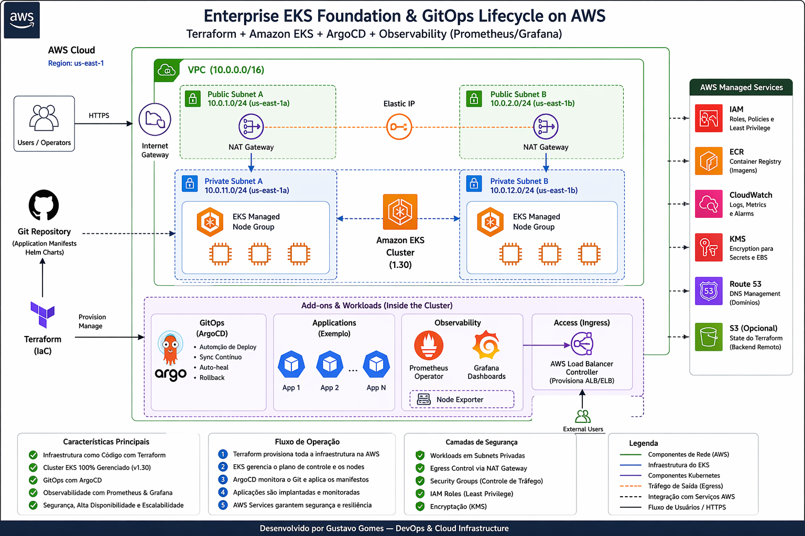
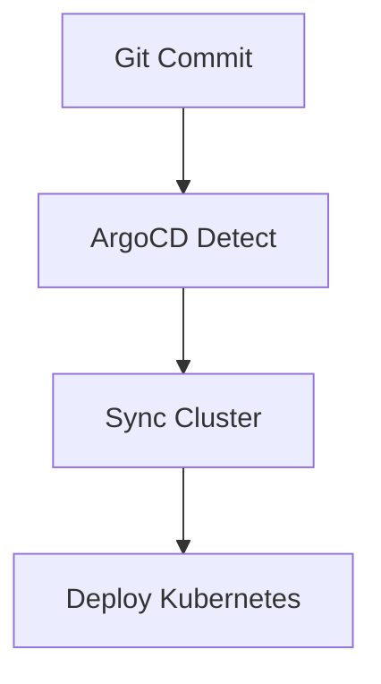

# 🚀 Production-Grade EKS Platform with Terraform & GitOps (ArgoCD)

<p align="center">


</p>

<p align="center">


</p>

---

## 🎯 Overview

Infraestrutura na AWS com Kubernetes (EKS), provisionada via Terraform e operada com GitOps usando ArgoCD.

---

## 🏗️ Arquitetura



---

## ⚡ Key Features

- ✅ Infraestrutura como código (Terraform)
- ✅ Kubernetes gerenciado (EKS 1.30)
- ✅ GitOps com ArgoCD
- ✅ Observabilidade completa (Prometheus + Grafana)
- ✅ Segurança com subnets privadas
- ✅ Alta disponibilidade multi-AZ

---

## 🧰 Stack Tecnológica

- AWS (EKS, EC2, VPC, IAM, ELB, NAT Gateway)
- Terraform (IaC)
- Kubernetes (EKS)
- ArgoCD (GitOps)
- Helm
- Prometheus + Grafana

---

## 🌐 Design de Rede

- VPC customizada (`10.0.0.0/16`)
- Subnets públicas e privadas
- NAT Gateway para saída controlada
- Workloads isoladas em subnets privadas

---

## ⚙️ Kubernetes (Amazon EKS)

- Versão: **1.30**
- Managed Node Groups
- Instâncias: `t3.small`
- OS: Amazon Linux 2023
- Multi-AZ

---

## 🔐 Autenticação Moderna (EKS Access Entry)

### Problema
Depreciação do `aws-auth ConfigMap`

### Solução
- Upgrade para Terraform v20+
- Uso de Access Entries (`API_AND_CONFIG_MAP`)

### Resultado
- Controle via API AWS
- Sem dependência de YAML

---

## 🐙 GitOps com ArgoCD

- Deploy automático via Git
- Sync contínuo
- Self-healing
- Rollback automático

### Fluxo



---

### 📊 Observabilidade
- Prometheus
- Grafana
- Node Exporter

---

### 🧠 Troubleshooting Real

- 🔥 EKS Authentication Failure
Causa: aws-auth deprecated
Solução: Access Entries

- 🔥 Terraform State Drift
Solução: terraform state rm + import

- 🔥 NAT Gateway Lock
Causa: EIP preso
Solução: remoção correta do NAT

---

### 🚀 Provisionamento

```bash

terraform init -upgrade
terraform apply --auto-approve
```

---

### 📈 Roadmap
- KMS Encryption
- AWS Load Balancer Controller (ALB)
- Karpenter (FinOps)

---

### 👨‍💻 Autor

Gustavo Gomes
DevOps & Cloud Infrastructure
